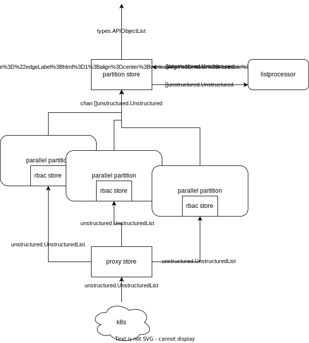

steve
=====

Steve is a lightweight API proxy for Kubernetes whose aim is to create an
interface layer suitable for dashboards to efficiently interact with
Kubernetes.

API Usage
---------

### Kubernetes proxy

Requests made to `/api`, `/api/*`, `/apis/*`, `/openapi/*` and `/version` will
be proxied directly to Kubernetes.

### /v1 API

Steve registers all Kubernetes resources as schemas in the /v1 API. Any
endpoint can support methods GET, POST, PATCH, PUT, or DELETE, depending on
what the underlying Kubernetes endpoint supports and the user's permissions.

* `/v1/{type}` - all cluster-scoped resources OR all resources in all
  namespaces of type `{type}` that the user has access to
* `/v1/{type}/{name}` - cluster-scoped resource of type `{type}` and unique name `{name}`
* `/v1/{type}/{namespace}` - all resources of type `{type}` under namespace `{namespace}`
* `/v1/{type}/{namespace}/{name}` - resource of type `{type}` under namespace
  `{namespace}` with name `{name}` unique within the namespace

### Query parameters

Steve supports query parameters to perform actions or process data on top of
what Kubernetes supports. In-depth, auto-generated API examples can be found in
[rancher](https://github.com/rancher/rancher/tree/release/v2.8/tests/v2/integration/steveapi#api-examples).

#### `link`

Trigger a link handler, which is registered with the schema. Examples are
calling the shell for a cluster, or following logs during cluster or catalog
operations:

```
GET /v1/management.cattle.io.clusters/local?link=log
```

#### `action`

Trigger an action handler, which is registered with the schema. Examples are
generating a kubeconfig for a cluster, or installing an app from a catalog:

```
POST /v1/catalog.cattle.io.clusterrepos/rancher-partner-charts?action=install
```

#### `limit`

Only applicable to list requests (`/v1/{type}` and `/v1/{type}/{namespace}`).

Set the maximum number of results to retrieve from Kubernetes. The limit is
passed on as a parameter to the Kubernetes request. The purpose of setting this
limit is to prevent a huge response from overwhelming Steve and Rancher. For
more information about setting limits, review the Kubernetes documentation on
[retrieving results in
chunks](https://kubernetes.io/docs/reference/using-api/api-concepts/#retrieving-large-results-sets-in-chunks).

The limit controls the size of the set coming from Kubernetes, and then
filtering, sorting, and pagination are applied on that set. Because of this, if
the result set is partial, there is no guarantee that the result returned to
the client is fully sorted across the entire list, only across the returned
chunk.

The returned response will include a `continue` token, which indicates that the
result is partial and must be used in the subsequent request to retrieve the
next chunk.

The default limit is 100000. To override the default, set `limit=-1`.

#### `continue`

Only applicable to list requests (`/v1/{type}` and `/v1/{type}/{namespace}`).

Continue retrieving the next chunk of a partial list. The continue token is
included in the response of a limited list and indicates that the result is
partial. This token can then be used as a query parameter to retrieve the next
chunk. All chunks have been retrieved when the continue field in the response
is empty.

#### `filter`

Only applicable to list requests (`/v1/{type}` and `/v1/{type}/{namespace}`).

Filter results by a designated field. Filter keys use dot notation to denote
the subfield of an object to filter on. The filter value is matched as a
substring.

Example, filtering by object name:

```
/v1/{type}?filter=metadata.name=foo
```

One filter can list multiple possible fields to match, these are ORed together:

```
/v1/{type}?filter=metadata.name=foo,metadata.namespace=foo
```

Stacked filters are ANDed together, so an object must match all filters to be
included in the list.

```
/v1/{type}?filter=metadata.name=foo&filter=metadata.namespace=bar
```

Filters can be negated to exclude results:

```
/v1/{type}?filter=metadata.name!=foo
```

Arrays are searched for matching items. If any item in the array matches, the
item is included in the list.

```
/v1/{type}?filter=spec.containers.image=alpine
```

#### `projectsornamespaces`

Resources can also be filtered by the Rancher projects their namespaces belong
to. Since a project isn't an intrinsic part of the resource itself, the filter
parameter for filtering by projects is separate from the main `filter`
parameter. This query parameter is only applicable when steve is running in
concert with Rancher.

The list can be filtered by either projects or namespaces or both.

Filtering by a single project or a single namespace:

```
/v1/{type}?projectsornamespaces=p1
```

Filtering by multiple projects or namespaces is done with a comma separated
list. A resource matching any project or namespace in the list is included in
the result:

```
/v1/{type}?projectsornamespaces=p1,n1,n2
```

The list can be negated to exclude results:

```
/v1/{type}?projectsornamespaces!=p1,n1,n2
```

#### `sort`

Only applicable to list requests (`/v1/{type}` and `/v1/{type}/{namespace}`).

Results can be sorted lexicographically by primary and secondary columns.

Sorting by only a primary column, for example name:

```
/v1/{type}?sort=metadata.name
```

Reverse sorting by name:

```
/v1/{type}?sort=-metadata.name
```

The secondary sort criteria is comma separated.

Example, sorting by name and creation time in ascending order:

```
/v1/{type}?sort=metadata.name,metadata.creationTimestamp
```

Reverse sort by name, normal sort by creation time:

```
/v1/{type}?sort=-metadata.name,metadata.creationTimestamp
```

Normal sort by name, reverse sort by creation time:

```
/v1/{type}?sort=metadata.name,-metadata.creationTimestamp
```

#### `page`, `pagesize`, and `revision`

Only applicable to list requests (`/v1/{type}` and `/v1/{type}/{namespace}`).

Results can be batched by pages for easier display.

Example initial request returning a page with 10 results:

```
/v1/{type}?pagesize=10
```

Pages are one-indexed, so this is equivalent to

```
/v1/{type}?pagesize=10&page=1
```
To retrieve subsequent pages, the page number and the list revision number must
be included in the request. This ensures the page will be retrieved from the
cache, rather than making a new request to Kubernetes. If the revision number
is omitted, a new fetch is performed in order to get the latest revision. The
revision is included in the list response.

```
/v1/{type}?pagezie=10&page=2&revision=107440
```

The total number of pages and individual items are included in the list
response as `pages` and `count` respectively.

If a page number is out of bounds, an empty list is returned.

`page` and `pagesize` can be used alongside the `limit` and `continue`
parameters supported by Kubernetes. `limit` and `continue` are typically used
for server-side chunking and do not guarantee results in any order.

Running the Steve server
------------------------

Steve is typically imported as a library. The calling code starts the server:

```go
import (
	"fmt"
	"context"

	"github.com/rancher/steve/pkg/server"
	"github.com/rancher/wrangler/pkg/kubeconfig"
)

func steve() error {
	restConfig, err := kubeconfig.GetNonInteractiveClientConfigWithContext("", "").ClientConfig()
	if err != nil {
		return err
	}
	ctx := context.Background()
	s, err := server.New(ctx, restConfig, nil)
	if err != nil {
		return err
	}
	fmt.Println(s.ListenAndServe(ctx, 9443, 9080, nil))
	return nil
}
```

steve can be run directly as a binary for testing. By default it runs on ports 9080 and 9443:

```sh
export KUBECONFIG=your.cluster
go run main.go
```

The API can be accessed by navigating to https://localhost:9443/v1.

Steve Features
--------------

Steve's main use is as an opinionated consumer of
[rancher/apiserver](https://github.com/rancher/apiserver), which it uses to
dynamically register every Kubernetes API as its own. It implements
apiserver
[Stores](https://pkg.go.dev/github.com/rancher/apiserver/pkg/types#Store) to
use Kubernetes as its data store.

### Stores

Steve uses apiserver Stores to transform and store data, mainly in Kubernetes.
The main mechanism it uses is the proxy store, which is actually a series of
four nested stores and a "partitioner". It can be instantiated by calling
[NewProxyStore](https://pkg.go.dev/github.com/rancher/steve/pkg/stores/proxy#NewProxyStore).
This gives you:

* [`proxy.errorStore`](https://github.com/rancher/steve/blob/master/pkg/stores/proxy/error_wrapper.go) -
  translates any returned errors into HTTP errors
* [`proxy.WatchRefresh`](https://pkg.go.dev/github.com/rancher/steve/pkg/stores/proxy#WatchRefresh) -
  wraps the nested store's Watch method, canceling the watch if access to the
  watched resource changes
* [`partition.Store`](https://pkg.go.dev/github.com/rancher/steve/pkg/stores/partition#Store) -
  wraps the nested store's List method and parallelizes the request according
  to the given partitioner, and additionally implements filtering, sorting, and
  pagination on the unstructured data from the nested store
* [`proxy.rbacPartitioner`](https://github.com/rancher/steve/blob/master/pkg/stores/proxy/rbac_store.go) -
  the partitioner fed to the `partition.Store` which allows it to parallelize
  requests based on the user's access to certain namespaces or resources
* [`proxy.Store`](https://pkg.go.dev/github.com/rancher/steve/pkg/stores/proxy#Store) -
  the Kubernetes proxy store which performs the actual connection to Kubernetes
  for all operations

The default schema additionally wraps this proxy store in
[`metrics.Store`](https://pkg.go.dev/github.com/rancher/steve/pkg/stores/metrics#Store),
which records request metrics to Prometheus, by calling
[`metrics.NewMetricsStore`](https://pkg.go.dev/github.com/rancher/steve/pkg/stores/metrics#NewMetricsStore)
on it.

Steve provides two additional exported stores that are mainly used by Rancher's
[catalogv2](https://github.com/rancher/rancher/tree/release/v2.7/pkg/catalogv2)
package:

* [`selector.Store`](https://pkg.go.dev/github.com/rancher/steve/pkg/stores/selector#Store)
  - wraps the list and watch commands with a label selector
* [`switchschema.Store`](https://pkg.go.dev/github.com/rancher/steve/pkg/stores/switchschema#Store)
  - transforms the object's schema

### Schemas

Steve watches all Kubernetes API resources, including built-ins, CRDs, and
APIServices, and registers them under its own /v1 endpoint. The component
responsible for watching and registering these schemas is the [schema
controller](https://github.com/rancher/steve/blob/master/pkg/controllers/schema/schemas.go).
Schemas can be queried from the /v1/schemas endpoint. Steve also registers a
few of its own schemas not from Kubernetes to facilitate certain use cases.

#### [Cluster](https://github.com/rancher/steve/tree/master/pkg/resources/cluster)

Steve creates a fake local cluster to use in standalone scenarios when there is
not a real
[clusters.management.cattle.io](https://pkg.go.dev/github.com/rancher/rancher/pkg/apis/management.cattle.io/v3#Cluster)
resource available. Rancher overrides this and sets its own customizations on
the cluster resource.

#### [User Preferences](https://github.com/rancher/steve/tree/master/pkg/resources/userpreferences)

User preferences in steve provides a way to configure dashboard preferences
through a configuration file named ``prefs.json``. Rancher overrides this and
uses the
[preferences.management.cattle.io](https://pkg.go.dev/github.com/rancher/rancher/pkg/apis/management.cattle.io/v3#Preference)
resource for preference storage instead.

#### [Counts](https://github.com/rancher/steve/tree/master/pkg/resources/counts)

Counts keeps track of the number of resources and updates the count in a
buffered stream that the dashboard can subscribe to.

#### [Subscribe](https://github.com/rancher/apiserver/tree/master/pkg/subscribe)

Steve exposes a websocket endpoint on /v1/subscribe for sending streams of
events. Connect to the endpoint using a websocket client like websocat:

```sh
websocat -k wss://127.0.0.1:9443/v1/subscribe
```

Review the [apiserver](https://github.com/rancher/apiserver#subscribe) guide
for details.

In addition to regular Kubernetes resources, steve allows you to subscribe to
special steve resources. For example, to subscribe to counts, send a websocket
message like this:

```
{"resourceType":"count"}
```

### Schema Templates

Existing schemas can be customized using schema templates. You can customize
individual schemas or apply customizations to all schemas.

For example, if you wanted to customize the store for secrets so that secret
data is always redacted, you could implement a store like this:

```go
import (
	"github.com/rancher/apiserver/pkg/store/empty"
	"github.com/rancher/apiserver/pkg/types"
)

type redactStore struct {
	empty.Store // must override the other interface methods as well
	            // or use a different nested store
}

func (r *redactStore) ByID(_ *types.APIRequest, _ *types.APISchema, id string) (types.APIObject, error) {
	return types.APIObject{
		ID: id,
		Object: map[string]string{
			"value": "[redacted]",
		},
	}, nil
}

func (r *redactStore) List(_ *types.APIRequest, _ *types.APISchema) (types.APIObjectList, error) {
	return types.APIObjectList{
		Objects: []types.APIObject{
			{
				Object: map[string]string{
					"value": "[redacted]",
				},
			},
		},
	}, nil
}
```

and then create a schema template for the schema with ID "secrets" that uses
that store:

```go
import (
	"github.com/rancher/steve/pkg/schema"
)

template := schema.Template{
	ID: "secret",
	Store: &redactStore{},
}
```

You could specify the same by providing the group and kind:

```go
template := schema.Template{
	Group: "", // core resources have an empty group
	Kind: "secret",
	Store: &redactStore{},
}
```

then add the template to the schema factory:

```go
schemaFactory.AddTemplate(template)
```

As another example, if you wanted to add custom field to all objects in a
collection response, you can add a schema template with a collection formatter
to omit the ID or the group and kind:

```go
template := schema.Template{
	Customize: func(schema *types.APISchema) {
		schema.CollectionFormatter = func(apiOp *types.APIRequest, collection *types.GenericCollection) {
			schema.CollectionFormatter = func(apiOp *types.APIRequest, collection *types.GenericCollection) {
				for _, d := range collection.Data {
					obj := d.APIObject.Object.(*unstructured.Unstructured)
					obj.Object["tag"] = "custom"
				}
			}
		}
	}
}
```

### Schema Access Control

Steve implements access control on schemas based on the user's RBAC in
Kubernetes.

The apiserver
[`Server`](https://pkg.go.dev/github.com/rancher/apiserver/pkg/server#Server)
object exposes an AccessControl field which is used to customize how access
control is performed on server requests.

An
[`accesscontrol.AccessStore`](https://pkg.go.dev/github.com/rancher/steve/pkg/accesscontrol#AccessStore)
is stored on the schema factory. When a user makes any request, the request
handler first finds all the schemas that are available to the user. To do this,
it first retrieves an
[`accesscontrol.AccessSet`](https://pkg.go.dev/github.com/rancher/steve/pkg/accesscontrol#AccessSet)
by calling
[`AccessFor`](https://pkg.go.dev/github.com/rancher/steve/pkg/accesscontrol#AccessStore.AccessFor)
on the user. The AccessSet contains a map of resources and the verbs that can
be used on them. The AccessSet is calculated by looking up all of the user's
role bindings and cluster role bindings for the user's name and group. The
result is cached, and the cached result is used until the user's role
assignments change. Once the AccessSet is retrieved, each registered schema is
checked for existence in the AccessSet, and filtered out if it is not
available.

This final set of schemas is inserted into the
[`types.APIRequest`](https://pkg.go.dev/github.com/rancher/apiserver/pkg/types#APIRequest)
object and passed to the apiserver handler.

### Authentication

Steve authenticates incoming requests using a customizable authentication
middleware. The default authenticator in standalone steve is the
[AlwaysAdmin](https://pkg.go.dev/github.com/rancher/steve/pkg/auth#AlwaysAdmin)
middleware, which accepts all incoming requests and sets admin attributes on
the user. The authenticator can be overridden by passing a custom middleware to
the steve server:

```go
import (
	"context"
	"github.com/rancher/steve/pkg/server"
	"github.com/rancher/steve/pkg/auth"
	"k8s.io/apiserver/pkg/authentication/user"
)

func run() {
	restConfig := getRestConfig()
	authenticator := func (req *http.Request) (user.Info, bool, error) {
		username, password, ok := req.BasicAuth()
		if !ok {
			return nil, false, nil
		}
		if username == "hello" && password == "world" {
			return &user.DefaultInfo{
				Name: username,
				UID: username,
				Groups: []string{
				    "system:authenticated",
				},
			}, true, nil
		}
		return nil, false, nil
	}
	server := server.New(context.TODO(), restConfig, &server.Options{
		AuthMiddleware: auth.ToMiddlware(auth.AuthenticatorFunc(authenticator)),
	}
	server.ListenAndServe(context.TODO(), 9443, 9080, nil)
}
```

Once the user is authenticated, if the request is for a Kubernetes resource,
then steve must proxy the request to Kubernetes, so it needs to transform the
request. Steve passes the user Info object from the authenticator to a proxy
handler, either a generic handler or an impersonating handler. The generic
[Handler](https://pkg.go.dev/github.com/rancher/steve/pkg/proxy#Handler) mainly
sets transport options and cleans up the headers on the request in preparation
for forwarding it to Kubernetes. The
[ImpersonatingHandler](https://pkg.go.dev/github.com/rancher/steve/pkg/proxy#ImpersonatingHandler)
uses the user Info object to set Impersonate-* headers on the request, which
Kubernetes uses to decide access.

### Dashboard

Steve is designed to be consumed by a graphical user interface and therefore
serves one by default, even in the test server. The default UI is the Rancher
Vue UI hosted on releases.rancher.com. It can be viewed by visiting the running
steve instance on port 9443 in a browser.

The UI can be enabled and customized by passing options to
[NewUIHandler](https://pkg.go.dev/github.com/rancher/steve/pkg/ui#NewUIHandler).
For example, if you have an alternative index.html file, add the file to
a directory called `./ui`, then create a route that serves a custom UI handler:

```go
import (
	"net/http"
	"github.com/rancher/steve/pkg/ui"
	"github.com/gorilla/mux"
)

func routes() http.Handler {
	custom := ui.NewUIHandler(&ui.Options{
		Index: func() string {
			return "./ui/index.html"
		},
	}
	router := mux.NewRouter()
	router.Handle("/hello", custom.IndexFile())
	return router
```

If no options are set, the UI handler will serve the latest index.html file
from the Rancher Vue UI.

### Cluster Cache

The cluster cache keeps watches of all resources with registered schemas. This
is mainly used to update the summary cache and resource counts, but any module
could add a handler to react to any resource change or get cached cluster data.
For example, if we wanted a handler to log all "add" events for newly created
secrets:

```go
import (
	"context"
	"github.com/rancher/steve/pkg/server"
	"k8s.io/apimachinery/pkg/runtime"
	"github.com/sirupsen/logrus"
	"k8s.io/apimachinery/pkg/runtime/schema"
)

func logSecretEvents(server *server.Server) {
	server.ClusterCache.OnAdd(context.TODO(), func(gvk schema.GroupVersionKind, key string, obj runtime.Object) error {
		if gvk.Kind == "Secret" {
			logrus.Infof("[event] add: %s", key)
		}
		return nil
	})
}
```

### Aggregation

Rancher uses a concept called "aggregation" to maintain connections to remote
services. Steve implements an aggregation client in order to allow connections
from Rancher and expose its API to Rancher.

Aggregation is enabled by defining a secret name and namespace in the steve
server:

```go
import (
	"context"
	"github.com/rancher/steve/pkg/server"
)

func run() {
	restConfig := getRestConfig()
	server := server.New(context.TODO(), restConfig, &server.Options{
		AggregationSecretNamespace: "cattle-system",
		AggregationSecretName: "stv-aggregation",
	})
	server.ListenAndServe(context.TODO(), 9443, 9080, nil)
}
```

This prompts the steve server to start a controller that watches for this
secret. The secret is expected to contain two pieces of data, a URL and a
token:

```sh
$ kubectl -n cattle-system get secret stv-aggregation -o yaml
apiVersion: v1
data:
  token: Zm9vYmFy
  url: aHR0cHM6Ly8xNzIuMTcuMC4xOjg0NDMvdjMvY29ubmVjdA==
kind: Secret
metadata:
...
```

Steve makes a websocket connection to the URL using the token to authenticate.
When the secret changes, the steve aggregation server restarts with the
up-to-date URL and token.

Through this websocket connection, the steve agent is exposed on the remote
management server and the management server can route steve requests to it. The
management server can also keep track of the availability of the agent by
detecting whether the websocket session is still active. In Rancher, the
connection endpoint runs on /v3/connect.

Rancher implements aggregation for other types of services as well. In Rancher,
the user can define endpoints via a
[v3.APIService](https://pkg.go.dev/github.com/rancher/rancher/pkg/apis/management.cattle.io/v3#APIService)
custom resource (which is distinct from the built-in Kubernetes
[v1.APIService](https://kubernetes.io/docs/reference/kubernetes-api/cluster-resources/api-service-v1/)
resource). Then Rancher runs a middleware handler that routes incoming requests
to defined endpoints. The external services follow the same process of using a
defined secret containing a URL and token to connect and authenticate to
Rancher. This aggregation is defined independently and does not use steve's
aggregation client.

### Design of List Processing API

Steve supports query parameters `filter`, `sort`, `page`/`pagesize`/`revision`,
and `projectsornamespaces` for list requests as described
[above](#query-parameters). These formatting options exist to allow user
interfaces like dashboards to easily consume and display list data in a
friendly way.

This feature relies on the concept of [stores](#stores) and the RBAC
partitioner. The [proxy
store](https://pkg.go.dev/github.com/rancher/steve/pkg/stores/proxy#Store)
provides raw access to Kubernetes and returns data as an
[unstructured.UnstructuredList](https://pkg.go.dev/k8s.io/apimachinery/pkg/apis/meta/v1/unstructured#UnstructuredList).
The
[partitioner](https://pkg.go.dev/github.com/rancher/steve/pkg/stores/partition#Partitioner)
calls the
proxy store in parallel for each segment of resources the user has access to,
such as for each namespace. The partitioner feeds the results of each parallelized
request into a stream of
[unstructured.Unstructured](https://pkg.go.dev/k8s.io/apimachinery/pkg/apis/meta/v1/unstructured#Unstructured).
From here, the list is passed to the
[listprocessor](https://pkg.go.dev/github.com/rancher/steve/pkg/stores/partition/listprocessor)
to filter, sort, and paginate the list. The partition store formats the list as
a
[types.APIObjectList](https://pkg.go.dev/github.com/rancher/apiserver/pkg/types#APIObjectList)
and it is returned up the chain of nested stores.

Most stores in steve are implementations of the apiserver
[Store](https://pkg.go.dev/github.com/rancher/apiserver/pkg/types#Store)
interface, which returns apiserver
[types](https://pkg.go.dev/github.com/rancher/apiserver/pkg/types). The
partitioner implements its own store type called
[UnstructuredStore](https://pkg.go.dev/github.com/rancher/steve/pkg/stores/partition#UnstructuredStore)
which returns
[unstructured.Unstructured](https://pkg.go.dev/k8s.io/apimachinery/pkg/apis/meta/v1/unstructured#Unstructured)
objects. The reason for this is that the filtering and sorting functions in the
listprocessor package need to operate on unstructured data because they work on
arbitrary fields. However, it also needs to be run after the parallelized
partitioner has accumulated all the results, because each concurrent fetcher
will only contain partial results. Therefore, the data remains in an
unstructured format until after the listprocessor has been run, then the data
is converted to a structured type. The below diagram illustrates the conversion
sequence.



#### Unit tests

The unit tests for these API features are located in two places:

##### listprocessor unit tests

[pkg/stores/partition/listprocessor/processor_test.go](./pkg/stores/partition/listprocessor/processor_test.go)
contains tests for each individual query handler. All changes to
[listprocessor](./pkg/stores/partition/listprocessor/) should include a unit
test in this file.

##### partition store unit tests

[pkg/stores/partition/store_test.go](./pkg/stores/partition/store_test.go)
contains tests for the `List` operation of the partition store. This is
especially important for testing the functionality for multiple partitions. It
also tests all supported query parameters, not limited to the
pagination-related ones, and tests them in combination with one another. Tests
should be added here when:

  - the change is related to partitioning
  - the change is related to parsing the query parameters
  - the change is related to the `limit` or `continue` parameters
  - the listprocessor change should be tested with other query parameters

It doesn't hurt to add a test here for any other listprocessor change.

Each table test runs several requests, so they are effectively each a bundle of
tests. Each table test has a list of `apiOps` which each specify the request
and the user running it, a list of `access` maps which declares the users
corresponding to each request and controls the
[AccessSet](https://pkg.go.dev/github.com/rancher/steve/pkg/accesscontrol#AccessSet)
the user has, the `partitions` the users have access to, and the `objects` in
each partition. The requests in `apiOps` are run sequentially, and each item in
the lists `want`, `wantCache`, and `wantListCalls` correlate to the expected
results and side effects of each request. `partitions` and `objects` apply to
all requests in the table test.

#### Integration tests

Integration tests for the steve API are located among the [rancher integration
tests](ihttps://github.com/rancher/rancher/tree/release/v2.8/tests/v2/integration/steveapi).
See the documentation included there for running the tests and using them to
generate API documentation.
