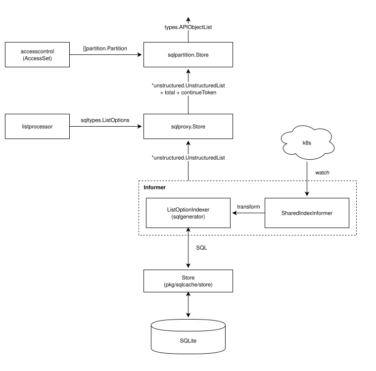

steve
=====

Steve is a lightweight API proxy for Kubernetes whose aim is to create an
interface layer suitable for dashboards to efficiently interact with
Kubernetes.

API Usage
---------

### Kubernetes proxy

Requests made to `/api`, `/api/*`, `/apis/*`, `/openapi/*` and `/version` will
be proxied directly to Kubernetes.

### /v1 API

Steve registers all Kubernetes resources as schemas in the /v1 API. Any
endpoint can support methods GET, POST, PATCH, PUT, or DELETE, depending on
what the underlying Kubernetes endpoint supports and the user's permissions.

* `/v1/{type}` - all cluster-scoped resources OR all resources in all
  namespaces of type `{type}` that the user has access to
* `/v1/{type}/{name}` - cluster-scoped resource of type `{type}` and unique name `{name}`
* `/v1/{type}/{namespace}` - all resources of type `{type}` under namespace `{namespace}`
* `/v1/{type}/{namespace}/{name}` - resource of type `{type}` under namespace
  `{namespace}` with name `{name}` unique within the namespace

### Query parameters

Steve supports query parameters to perform actions or process data on top of
what Kubernetes supports. In-depth, auto-generated API examples can be found in
[rancher](https://github.com/rancher/rancher/tree/release/v2.8/tests/v2/integration/steveapi#api-examples).

#### `link`

Trigger a link handler, which is registered with the schema. Examples are
calling the shell for a cluster, or following logs during cluster or catalog
operations:

```
GET /v1/management.cattle.io.clusters/local?link=log
```

#### `action`

Trigger an action handler, which is registered with the schema. Examples are
generating a kubeconfig for a cluster, or installing an app from a catalog:

```
POST /v1/catalog.cattle.io.clusterrepos/rancher-partner-charts?action=install
```

### List-specific query parameters

List requests (`/v1/{type}` and `/v1/{type}/{namespace}`) have additional
parameters for filtering, sorting and pagination.

Steve always caches resources in SQLite. The cache is configured when calling
`server.New` via `server.Options.SQLCacheFactoryOptions`.

Note that some of the cached data is stored on disk, in either encrypted or
plain text form, based on:
 - by default, Secrets and Rancher Tokens (`management.cattle.io/v3, Kind=Token`) are always encrypted
 - if the environment variable `CATTLE_ENCRYPT_CACHE_ALL` is set to "true",
all resources are encrypted
 - regardless of the setting's value, any filterable/sortable columns are stored
in plain text (see `filter` below for the exact list)

#### `limit`

Set the maximum number of results to return from the SQLite cache.

If both this parameter and `pagesize` are set, the smallest is taken.

The returned response will include a `continue` token, which indicates that the
result is partial and must be used in the subsequent request to retrieve the
next chunk.

The default limit is 100000. To override the default, set `limit=-1`.

#### `continue`

Continue retrieving the next chunk of a partial list. The continue token is
included in the response of a limited list and indicates that the result is
partial. This token can then be used as a query parameter to retrieve the next
chunk. All chunks have been retrieved when the continue field in the response
is empty.

#### `filter`

Filter results by a designated field. Filter keys use dot notation to denote
the subfield of an object to filter on. The filter value is normally matched as a
substring.

Example, filtering by object name:

```
/v1/{type}?filter=metadata.name=foo
```

Equality can be specified with either one or two '=' signs.

The following matches objects called either 'cat' or 'cows':

```
filter=metadata.name=cat,metadata.name=cows
```

The following matches objects whose names contain either the substring 'cat' or 'cows':

```
filter=metadata.name~cat,metadata.name~cows
```

For example, this will match an object with `metadata.name=cowcatcher`

Set membership is done with the `in` operator:

```
filter=metadata.name in (cat, cows)
```

When called via `http` the spaces will need to be encoded either as `+` or `%20`.

There are negative forms of the above operators:

```
filter=metadata.name!=dog  # no dogs allowed
filter=metadata.name!~x    # skip any names containing an 'x'
filter=metadata.name notin (goldfish, silverfish) # ignore these
```

Labels can be tested with the implicit "EXISTS" operator:

```
filter=metadata.labels[cattle.io.fences/wooden]
```

This will select any objects that have the specified label.  Negate this test by
preceding it with a `!`:

```
filter=!metadata.labels[cattle.io.fences/bamboo]
```

Existence tests only work for `metadata.labels`.

If you need to do a numeric computation, you can use the `<` and `>` operators.

```
filter=metadata.fields[3]>10&metadata.fields[3]<20
```

This is specific to a particular kind of Kubernetes object.

Finally, most values need to conform to specific syntaxes. But if the VALUE in an
expression contains unusual characters, you can quote the value with either single
or double quotes:

```
filter=metadata.name="oxford,metadata.labels.comma"
```

Without the quotes, the expression would be finding either objects called `oxford`,
or that have the label "comma", which is very different from objects called `oxford,metadata.labels.comma`.

One filter can list multiple possible fields to match, these are ORed together:

```
/v1/{type}?filter=metadata.name=foo,metadata.namespace=foo
```

Stacked filters are ANDed together, so an object must match all filters to be
included in the list.

```
/v1/{type}?filter=metadata.name=foo&filter=metadata.namespace=bar
```

Filters can be negated to exclude results:

```
/v1/{type}?filter=metadata.name!=foo
```

Multiple values are stored separated by "or-bars" (`|`), like `abc|def|ghi`.
You'll need to use the partial-match operator `~` to match one member,
like `/v1/{type}?filter=spec.containers.image ~ ghi`.

Filtering is only supported for a subset of attributes:
- `id`, `metadata.name`, `metadata.namespace`, `metadata.state.name`, and `metadata.timestamp` for any resource kind
- a short list of hardcoded attributes for a selection of specific types listed
in [typeSpecificIndexFields](https://github.com/rancher/steve/blob/main/pkg/stores/sqlproxy/proxy_store.go#L52-L58)
- the special string `metadata.fields[N]`, with N starting at 0, for all columns
displayed by `kubectl get $TYPE`. For example `secrets` have `"metadata.fields[0]"`,
`"metadata.fields[1]"` , `"metadata.fields[2]"`, and `"metadata.fields[3]"` respectively
corresponding to `"name"`, `"type"`, `"data"`, and `"age"`. For CRDs, these come from
[Additional printer columns](https://kubernetes.io/docs/tasks/extend-kubernetes/custom-resources/custom-resource-definitions/#additional-printer-columns)

When matching on array-type fields, the array's values are stored in the database as a single field separated by or-bars (`|`s).=
So searching for those fields needs to do a partial match when a field contains more than one value.

#### `projectsornamespaces`

Resources can also be filtered by the Rancher projects their namespaces belong
to. Since a project isn't an intrinsic part of the resource itself, the filter
parameter for filtering by projects is separate from the main `filter`
parameter. This query parameter is only applicable when steve is running in
concert with Rancher.

The list can be filtered by either projects or namespaces or both.

Filtering by a single project or a single namespace:

```
/v1/{type}?projectsornamespaces=p1
```

Filtering by multiple projects or namespaces is done with a comma separated
list. A resource matching any project or namespace in the list is included in
the result:

```
/v1/{type}?projectsornamespaces=p1,n1,n2
```

The list can be negated to exclude results:

```
/v1/{type}?projectsornamespaces!=p1,n1,n2
```

#### `sort`

Results can be sorted lexicographically by any number of columns given in descending order of importance.

Sorting by only a single column, for example name:

```
/v1/{type}?sort=metadata.name
```

Reverse sorting by name:

```
/v1/{type}?sort=-metadata.name
```

Multiple sort criteria are comma separated.

Example, sorting first by name and then by creation time in ascending order:

```
/v1/{type}?sort=metadata.name,metadata.creationTimestamp
```

Reverse sort by name, then normal sort by creation time:

```
/v1/{type}?sort=-metadata.name,metadata.creationTimestamp
```

Normal sort by namespace, then by name, reverse sort by creation time:

```
/v1/{type}?sort=metadata.namespace,metadata.name,-metadata.creationTimestamp
```

Sorting is only supported for the set of attributes supported by
filtering (see above).

Sorting by labels can use complex label names.
This query sorts by app name within their architectures, with the architectures
listed in reverse lexicographic order. Note that complex label names need to be
surrounded by square brackets (which themselves need to be percent-escaped for some web queries)

```
/v1/nodes?sort=-metadata.labels[kubernetes.io/arch],metadata.name
```

#### `page`, `pagesize`, and `revision`

Results can be batched by pages for easier display.

Example initial request returning a page with 10 results:

```
/v1/{type}?pagesize=10
```

Pages are one-indexed, so this is equivalent to

```
/v1/{type}?pagesize=10&page=1
```

To retrieve subsequent pages, only the page number is necessary, and it
will always return the latest version.
```
/v1/{type}?pagesize=10&page=2
```

If both `pagesize` and `limit` are set, the smallest is taken.

If both `page` and `continue` are set, the result is the `page`-th page
after the last result specified by `continue`.

**If `revision` is passed:**
`revision` sets a minimum numerical value for resourceVersion in a LIST request. If the server's cached resourceVersion for that GVK is older than the revision provided, an "unknown revision" error is returned.

The total number of pages and individual items are included in the list
response as `pages` and `count` respectively.

If a page number is out of bounds, an empty list is returned.

### /v1/subscribe (Watch API)

Steve provides real-time updates for Kubernetes resources through a WebSocket-based Watch API, available at the `/v1/subscribe` endpoint. This API leverages the generic subscription framework from [rancher/apiserver](https://github.com/rancher/apiserver).

To test, connect to the endpoint using a websocket client like websocat:

```sh
websocat -k wss://127.0.0.1:9443/v1/subscribe
```

When using Steve as integrated in Rancher, you can connect by:

- Creating an API token:
  - Open Rancher in a browser, log in
  - Click on the user icon in the top-right corner
  - Click on "Account and API Keys"
  - Click on "Create API Key"
  - Add a Description, click Create
  - Copy the "Bearer Token" value
- Using the following lines:

```sh
read RANCHER_TOKEN
websocat --header="Cookie: R_SESS=$RANCHER_TOKEN" wss://my.rancher.server/v1/subscribe
```

Review the  [rancher/apiserver](https://github.com/rancher/apiserver) README for protocol details.

In addition to regular Kubernetes resources, steve allows you to subscribe to
special steve resources. For example, to subscribe to counts, send a websocket
message like this:

```
{"resourceType":"count"}
```

Running the Steve server
------------------------

Steve is typically imported as a library. The calling code starts the server:

```go
import (
	"fmt"
	"context"

	"github.com/rancher/steve/pkg/server"
	"github.com/rancher/wrangler/v3/pkg/kubeconfig"
)

func steve() error {
	restConfig, err := kubeconfig.GetNonInteractiveClientConfigWithContext("", "").ClientConfig()
	if err != nil {
		return err
	}
	ctx := context.Background()
	s, err := server.New(ctx, restConfig, nil)
	if err != nil {
		return err
	}
	fmt.Println(s.ListenAndServe(ctx, 9443, 9080, nil))
	return nil
}
```

steve can be run directly as a binary for testing. By default it runs on ports 9080 and 9443:

```sh
export KUBECONFIG=your.cluster
go run main.go
```

The API can be accessed by navigating to https://localhost:9443/v1.

### Running the pprof server

You can enable the `pprof` http server when running steve as a binary by
enabling pprof with `--enable-pprof`.

```
go run . --enable-pprof
```

It is then possible to use `go tool pprof` to view profiles. (You might need
[graphviz](https://www.graphviz.org/)) For example:

```
go tool pprof -no_browser -http localhost:31000 http://localhost:6060/debug/pprof/goroutine
```

Steve Features
--------------

Steve's main use is as an opinionated consumer of
[rancher/apiserver](https://github.com/rancher/apiserver), which it uses to
dynamically register every Kubernetes API as its own. It implements
apiserver
[Stores](https://pkg.go.dev/github.com/rancher/apiserver/pkg/types#Store) to
use Kubernetes as its data store.

### Stores

Steve uses apiserver Stores to transform and store data, mainly in Kubernetes.
The main mechanism it uses is the SQL-backed proxy store, which is a series of
four nested stores. It is assembled in
[`server.setup`](https://github.com/rancher/steve/blob/main/pkg/server/server.go)
and gives you:

* [`proxy.errorStore`](https://github.com/rancher/steve/blob/main/pkg/stores/proxy/error_wrapper.go) -
  translates any returned errors into HTTP errors
* [`proxy.unformatterStore`](https://github.com/rancher/steve/blob/main/pkg/stores/proxy/unformatter.go) -
  removes fields added by the formatter that Kubernetes cannot recognize
* [`proxy.WatchRefresh`](https://pkg.go.dev/github.com/rancher/steve/pkg/stores/proxy#WatchRefresh) -
  wraps the nested store's Watch method, canceling the watch if access to the
  watched resource changes
* [`sqlpartition.Store`](https://pkg.go.dev/github.com/rancher/steve/pkg/stores/sqlpartition#Store) -
  turns the request into the set of partitions (namespaces or resource names)
  the user has access to, and passes them on to the nested store
* [`sqlproxy.Store`](https://pkg.go.dev/github.com/rancher/steve/pkg/stores/sqlproxy#Store) -
  serves lists and watches from the SQLite cache, and connects to Kubernetes
  for all other operations

The default schema additionally wraps this proxy store in
[`metrics.Store`](https://pkg.go.dev/github.com/rancher/steve/pkg/stores/metrics#Store),
which records request metrics to Prometheus, by calling
[`metrics.NewMetricsStore`](https://pkg.go.dev/github.com/rancher/steve/pkg/stores/metrics#NewMetricsStore)
on it.

Steve provides two additional exported stores that are mainly used by Rancher's
[catalogv2](https://github.com/rancher/rancher/tree/release/v2.7/pkg/catalogv2)
package:

* [`selector.Store`](https://pkg.go.dev/github.com/rancher/steve/pkg/stores/selector#Store)
  - wraps the list and watch commands with a label selector
* [`switchschema.Store`](https://pkg.go.dev/github.com/rancher/steve/pkg/stores/switchschema#Store)
  - transforms the object's schema

### Schemas

Steve watches all Kubernetes API resources, including built-ins, CRDs, and
APIServices, and registers them under its own /v1 endpoint. The component
responsible for watching and registering these schemas is the [schema
controller](https://github.com/rancher/steve/blob/master/pkg/controllers/schema/schemas.go).
Schemas can be queried from the /v1/schemas endpoint. Steve also registers a
few of its own schemas not from Kubernetes to facilitate certain use cases.

#### [Cluster](https://github.com/rancher/steve/tree/master/pkg/resources/cluster)

Steve creates a fake local cluster to use in standalone scenarios when there is
not a real
[clusters.management.cattle.io](https://pkg.go.dev/github.com/rancher/rancher/pkg/apis/management.cattle.io/v3#Cluster)
resource available. Rancher overrides this and sets its own customizations on
the cluster resource.

#### [User Preferences](https://github.com/rancher/steve/tree/master/pkg/resources/userpreferences)

User preferences in steve provides a way to configure dashboard preferences
through a configuration file named ``prefs.json``. Rancher overrides this and
uses the
[preferences.management.cattle.io](https://pkg.go.dev/github.com/rancher/rancher/pkg/apis/management.cattle.io/v3#Preference)
resource for preference storage instead.

#### [Counts](https://github.com/rancher/steve/tree/master/pkg/resources/counts)

Counts keeps track of the number of resources and updates the count in a
buffered stream that the dashboard can subscribe to.

### Schema Templates

Existing schemas can be customized using schema templates. You can customize
individual schemas or apply customizations to all schemas.

For example, if you wanted to customize the store for secrets so that secret
data is always redacted, you could implement a store like this:

```go
import (
	"github.com/rancher/apiserver/pkg/store/empty"
	"github.com/rancher/apiserver/pkg/types"
)

type redactStore struct {
	empty.Store // must override the other interface methods as well
	            // or use a different nested store
}

func (r *redactStore) ByID(_ *types.APIRequest, _ *types.APISchema, id string) (types.APIObject, error) {
	return types.APIObject{
		ID: id,
		Object: map[string]string{
			"value": "[redacted]",
		},
	}, nil
}

func (r *redactStore) List(_ *types.APIRequest, _ *types.APISchema) (types.APIObjectList, error) {
	return types.APIObjectList{
		Objects: []types.APIObject{
			{
				Object: map[string]string{
					"value": "[redacted]",
				},
			},
		},
	}, nil
}
```

and then create a schema template for the schema with ID "secrets" that uses
that store:

```go
import (
	"github.com/rancher/steve/pkg/schema"
)

template := schema.Template{
	ID: "secret",
	Store: &redactStore{},
}
```

You could specify the same by providing the group and kind:

```go
template := schema.Template{
	Group: "", // core resources have an empty group
	Kind: "secret",
	Store: &redactStore{},
}
```

then add the template to the schema factory:

```go
schemaFactory.AddTemplate(template)
```

As another example, if you wanted to add a custom field to all objects in a
collection response, you can add a schema template with a collection formatter
to omit the ID or the group and kind:

```go
template := schema.Template{
	Customize: func(schema *types.APISchema) {
		schema.CollectionFormatter = func(apiOp *types.APIRequest, collection *types.GenericCollection) {
			for _, d := range collection.Data {
				obj := d.APIObject.Object.(*unstructured.Unstructured)
				obj.Object["tag"] = "custom"
			}
		}
	}
}
```

### Schema Access Control

Steve implements access control on schemas based on the user's RBAC in
Kubernetes.

The apiserver
[`Server`](https://pkg.go.dev/github.com/rancher/apiserver/pkg/server#Server)
object exposes an AccessControl field which is used to customize how access
control is performed on server requests.

An
[`accesscontrol.AccessStore`](https://pkg.go.dev/github.com/rancher/steve/pkg/accesscontrol#AccessStore)
is stored on the schema factory. When a user makes any request, the request
handler first finds all the schemas that are available to the user. To do this,
it first retrieves an
[`accesscontrol.AccessSet`](https://pkg.go.dev/github.com/rancher/steve/pkg/accesscontrol#AccessSet)
by calling
[`AccessFor`](https://pkg.go.dev/github.com/rancher/steve/pkg/accesscontrol#AccessStore.AccessFor)
on the user. The AccessSet contains a map of resources and the verbs that can
be used on them. The AccessSet is calculated by looking up all of the user's
role bindings and cluster role bindings for the user's name and group. The
result is cached, and the cached result is used until the user's role
assignments change. Once the AccessSet is retrieved, each registered schema is
checked for existence in the AccessSet, and filtered out if it is not
available.

This final set of schemas is inserted into the
[`types.APIRequest`](https://pkg.go.dev/github.com/rancher/apiserver/pkg/types#APIRequest)
object and passed to the apiserver handler.

### Authentication

Steve authenticates incoming requests using a customizable authentication
middleware. The default authenticator in standalone steve is the
[AlwaysAdmin](https://pkg.go.dev/github.com/rancher/steve/pkg/auth#AlwaysAdmin)
middleware, which accepts all incoming requests and sets admin attributes on
the user. The authenticator can be overridden by passing a custom middleware to
the steve server:

```go
import (
	"context"
	"github.com/rancher/steve/pkg/server"
	"github.com/rancher/steve/pkg/auth"
	"k8s.io/apiserver/pkg/authentication/user"
)

func run() {
	restConfig := getRestConfig()
	authenticator := func (req *http.Request) (user.Info, bool, error) {
		username, password, ok := req.BasicAuth()
		if !ok {
			return nil, false, nil
		}
		if username == "hello" && password == "world" {
			return &user.DefaultInfo{
				Name: username,
				UID: username,
				Groups: []string{
				    "system:authenticated",
				},
			}, true, nil
		}
		return nil, false, nil
	}
	server := server.New(context.TODO(), restConfig, &server.Options{
		AuthMiddleware: auth.ToMiddlware(auth.AuthenticatorFunc(authenticator)),
	}
	server.ListenAndServe(context.TODO(), 9443, 9080, nil)
}
```

Once the user is authenticated, if the request is for a Kubernetes resource,
then steve must proxy the request to Kubernetes, so it needs to transform the
request. Steve passes the user Info object from the authenticator to a proxy
handler, either a generic handler or an impersonating handler. The generic
[Handler](https://pkg.go.dev/github.com/rancher/steve/pkg/proxy#Handler) mainly
sets transport options and cleans up the headers on the request in preparation
for forwarding it to Kubernetes. The
[ImpersonatingHandler](https://pkg.go.dev/github.com/rancher/steve/pkg/proxy#ImpersonatingHandler)
uses the user Info object to set Impersonate-* headers on the request, which
Kubernetes uses to decide access.

### Dashboard

Steve is designed to be consumed by a graphical user interface and therefore
serves one by default, even in the test server. The default UI is the Rancher
Vue UI hosted on releases.rancher.com. It can be viewed by visiting the running
steve instance on port 9443 in a browser.

The UI can be enabled and customized by passing options to
[NewUIHandler](https://pkg.go.dev/github.com/rancher/steve/pkg/ui#NewUIHandler).
For example, if you have an alternative index.html file, add the file to
a directory called `./ui`, then create a route that serves a custom UI handler:

```go
import (
	"net/http"
	"github.com/rancher/steve/pkg/ui"
	"github.com/gorilla/mux"
)

func routes() http.Handler {
	custom := ui.NewUIHandler(&ui.Options{
		Index: func() string {
			return "./ui/index.html"
		},
	}
	router := mux.NewRouter()
	router.Handle("/hello", custom.IndexFile())
	return router
```

If no options are set, the UI handler will serve the latest index.html file
from the Rancher Vue UI.

### Cluster Cache

The cluster cache keeps watches of all resources with registered schemas. This
is mainly used to update the summary cache and resource counts, but any module
could add a handler to react to any resource change or get cached cluster data.
For example, if we wanted a handler to log all "add" events for newly created
secrets:

```go
import (
	"context"
	"github.com/rancher/steve/pkg/server"
	"k8s.io/apimachinery/pkg/runtime"
	"github.com/sirupsen/logrus"
	"k8s.io/apimachinery/pkg/runtime/schema"
)

func logSecretEvents(server *server.Server) {
	server.ClusterCache.OnAdd(context.TODO(), func(gvk schema.GroupVersionKind, key string, obj runtime.Object) error {
		if gvk.Kind == "Secret" {
			logrus.Infof("[event] add: %s", key)
		}
		return nil
	})
}
```

### Aggregation

Rancher uses a concept called "aggregation" to maintain connections to remote
services. Steve implements an aggregation client in order to allow connections
from Rancher and expose its API to Rancher.

Aggregation is enabled by defining a secret name and namespace in the steve
server:

```go
import (
	"context"
	"github.com/rancher/steve/pkg/server"
)

func run() {
	restConfig := getRestConfig()
	server := server.New(context.TODO(), restConfig, &server.Options{
		AggregationSecretNamespace: "cattle-system",
		AggregationSecretName: "stv-aggregation",
	})
	server.ListenAndServe(context.TODO(), 9443, 9080, nil)
}
```

This prompts the steve server to start a controller that watches for this
secret. The secret is expected to contain two pieces of data, a URL and a
token:

```sh
$ kubectl -n cattle-system get secret stv-aggregation -o yaml
apiVersion: v1
data:
  token: Zm9vYmFy
  url: aHR0cHM6Ly8xNzIuMTcuMC4xOjg0NDMvdjMvY29ubmVjdA==
kind: Secret
metadata:
...
```

Steve makes a websocket connection to the URL using the token to authenticate.
When the secret changes, the steve aggregation server restarts with the
up-to-date URL and token.

Through this websocket connection, the steve agent is exposed on the remote
management server and the management server can route steve requests to it. The
management server can also keep track of the availability of the agent by
detecting whether the websocket session is still active. In Rancher, the
connection endpoint runs on /v3/connect.

Rancher implements aggregation for other types of services as well. In Rancher,
the user can define endpoints via a
[v3.APIService](https://pkg.go.dev/github.com/rancher/rancher/pkg/apis/management.cattle.io/v3#APIService)
custom resource (which is distinct from the built-in Kubernetes
[v1.APIService](https://kubernetes.io/docs/reference/kubernetes-api/cluster-resources/api-service-v1/)
resource). Then Rancher runs a middleware handler that routes incoming requests
to defined endpoints. The external services follow the same process of using a
defined secret containing a URL and token to connect and authenticate to
Rancher. This aggregation is defined independently and does not use steve's
aggregation client.

### Design of List Processing API

Steve supports query parameters `filter`, `sort`, `page`/`pagesize`/`revision`,
and `projectsornamespaces` for list requests as described
[above](#query-parameters). These formatting options exist to allow user
interfaces like dashboards to easily consume and display list data in a
friendly way.

This feature relies on the concept of [stores](#stores) and the RBAC
partitioner. The
[sqlpartition.Store](https://pkg.go.dev/github.com/rancher/steve/pkg/stores/sqlpartition#Store)
turns the request into the set of
[partitions](https://pkg.go.dev/github.com/rancher/steve/pkg/sqlcache/partition#Partition)
the user has access to, such as a set of namespaces or resource names, and the
[sqlproxy.Store](https://pkg.go.dev/github.com/rancher/steve/pkg/stores/sqlproxy#Store)
resolves them into a single SQL query against the SQLite cache. Filtering,
sorting and pagination are therefore all done by the database rather than in
Go, over the whole list rather than a chunk of it.

The query parameters are parsed by the
[listprocessor](https://pkg.go.dev/github.com/rancher/steve/pkg/stores/sqlpartition/listprocessor)
into a
[sqltypes.ListOptions](https://pkg.go.dev/github.com/rancher/steve/pkg/sqlcache/sqltypes#ListOptions),
which the
[ListOptionIndexer](https://pkg.go.dev/github.com/rancher/steve/pkg/sqlcache/informer#ListOptionIndexer)
converts into SQL. The result comes back as an
[unstructured.UnstructuredList](https://pkg.go.dev/k8s.io/apimachinery/pkg/apis/meta/v1/unstructured#UnstructuredList),
which the partition store formats as a
[types.APIObjectList](https://pkg.go.dev/github.com/rancher/apiserver/pkg/types#APIObjectList)
before it is returned up the chain of nested stores.

The cache itself is filled independently of any request. A
[SharedIndexInformer](https://pkg.go.dev/k8s.io/client-go/tools/cache#SharedIndexInformer)
watches Kubernetes and writes each object through the ListOptionIndexer, which
is installed as that informer's indexer, so the read and write paths share a
single
[Store](https://pkg.go.dev/github.com/rancher/steve/pkg/sqlcache/store#Store)
and SQLite database. The below diagram illustrates both paths.



#### Unit tests

The unit tests for these API features are located in two places:

##### listprocessor unit tests

[pkg/stores/sqlpartition/listprocessor/processor_test.go](./pkg/stores/sqlpartition/listprocessor/processor_test.go)
contains tests for each individual query handler. All changes to
[listprocessor](./pkg/stores/sqlpartition/listprocessor/) should include a unit
test in this file.

##### query generation unit tests

[pkg/sqlcache/informer/sqlgenerator_test.go](./pkg/sqlcache/informer/sqlgenerator_test.go)
contains tests asserting the SQL generated for a given set of list options and
partitions. Tests should be added here when:

  - the change is related to partitioning
  - the change is related to parsing the query parameters
  - the change is related to the `limit` or `continue` parameters
  - the listprocessor change affects the generated query

#### Integration tests

New integration tests for the steve API are located in the `tests/` directory.
Refer to [tests/integration/README.md](./tests/integration/README.md) for documentation on running and adding these tests.

## Running Tests

Some of steve's tests make use of [envtest](https://book.kubebuilder.io/reference/envtest) to run. Envtest allows tests to run against a "fake" kubernetes server with little/no overhead.

To use `setup-envtest`, you can run it via `go tool`:

```bash
go tool -modfile gotools/setup-envtest/go.mod setup-envtest -h
```

Before running the tests, you must run the following command to setup the fake server:

```bash
# note that this will use a new/latest version of k8s. Our CI will run against the version of k8s that corresponds to steve's
# current client-go version, as seen in scripts/test.sh
export KUBEBUILDER_ASSETS=$(go tool -modfile gotools/setup-envtest/go.mod setup-envtest use -p path)
```

# Versioning

See [VERSION.md](VERSION.md).

# Releasing

Releases are cut by triggering the [Cut release workflow](.github/workflows/cut-release.yaml)
from the GitHub Actions tab. Select the appropriate release branch (e.g. `release/v0.5`)
and provide the version (e.g. `v0.5.1`) as input. The workflow validates the version
against [VERSION.md](VERSION.md), creates the annotated tag, and dispatches the
[On release workflow](.github/workflows/release.yaml) on the new tag, which creates
the GitHub release.
